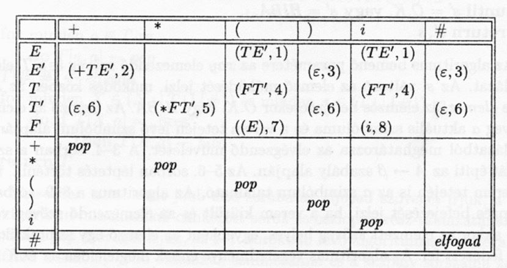
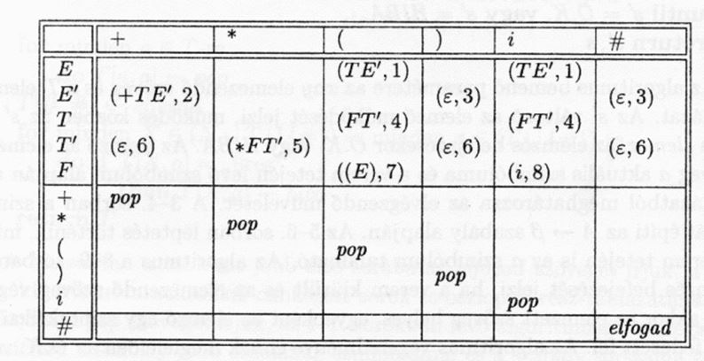

# Forditoprogramok_Beadando

<h1>Help</h1>

G = ({E, E’, T, T’, F}, {+, *, (, ), i}, P, E)

S -> E#  
E’ -> +TE’ | e  
T -> FT’  
T’ -> *FT’ | e  
F -> (E) | i  

A nyelvtan segítségével a következő kifejezések validálhatók:

( 3 * 3 ) + 2 

A kifejezéseket egyszerűsíteni kell a következő formában:

pl.: ( 3 * 4 ) + 2 kifejezésből az ( i + i ) * i egyszerűsített formulát kell létrehozni a következő reguláris kifejezéssel:

expressionstring = Regex.Replace(expressionstring, ”[0-9]+”, ”i” );

i + ( i * i ), i + i, i * i, ...

A szabályrendszer alkalmazásához az alábbi táblázatot kell használni. 

A program a következő módon működik:

Az algoritmus
1.	Szükség van egy input szalagra, ami egy string típusú változó és egy int típusú változóra az input indexeléséhez. 
2.	A táblázatot tárolni kell egy StringGrid, vagy hasonló típusú kontrollban. A tárolás történhet grafikusan, vagy egy n*m-es string mátrixban.

3.	Szükség van egy Stack típusú változóra. Az elemzés során ebbe a verembe terminális és nemterminális jelek kerülnek bele. A verem kezdetben a szabályrendszer start szimbólumát tartalmazza (E).
4.	Az input változó kezdetben a teljes elemzendő kifejezést tartalmazza. Pl.: String input = ”(i+i)*i#”. Az input kifejezés végére egy # jelet kell elhelyezni.
5.	A működési ciklus a következő: Be kell olvasni a soron következő elemet (minden lépésben az i index alapján az aktuális karaktert) az input szalagról.
6.	Ki kell venni a verem legfelső elemét (POP művelet).
7.	Az így kapott adatokat sor és oszlopindexnek kell használni a szabályokat tartalmazó mátrix indexeléséhez.
8.	Az így azonosított cellából vegyük ki az ott található elemet (a mátrixnak az az eleme, amit a két kiolvasott elem alapján azonosítunk).
9.	Pl.: ha az input string aktuális eleme a +, a veremben pedig az E’ nemterminális elem található, akkor az azonosított cella a (+TE’, 2), ahol a vessző bal oldalán egy szabály jobb oldala, a vessző jobb oldalán pedig a szabály sorszáma található.
10.	Az azonosított cellában 4 féle elem fordulhat elő.
There are 4 types of items that can occur in an identified cell.
* Ha a cella üres, az azt jelenti, hogy a kifejezésben hibát találtunk.
Ha a cella az elfogad szót tartalmazza, akkor a végére értünk az elemzésnek, és a kifejezés helyes.
* Ha a pop szó található a cellában, akkor el kell távolítani a verem tetején található elemet (egy karaktert, ami lehet terminális, vagy nemterminális jel), és az indexet léptetni kell, vagyis megnövelni az index változó értékét eggyel.
* Ha a cella egy zárójeles szabályt tartalmaz, akkor:
* El kell távolítani a zárójeleket.

11.	a vessző bal oldalán található szabályt és a jobb oldalán található sorszámot be kell tenni egy-egy változóba (pl.: a string[] elemek = String.Split(elemek, ”,”) metódussal).
A vessző bal oldalán található szabályt karakterenként a verembe kell helyezni.
A szabály sorszámát el kell tárolni egy listába. Ezt az adatot nem használjuk, de a segítségével elő lehet állítani a program szintaxis fáját.
Az 5-10 lépéseket addig kell ismételni, amíg el nem érjük az input végét, vagy hibát nem találunk.
Amennyiben a működési ciklus végén a verem üres, és az input szalag végére értünk, a kifejezés helyes.
Ezt úgy is megállapíthatjuk, ha a két változó által azonosított cella a szabályokat tartalmazó mátrixban az elfogad szót tartalmazza.

A programnak folyamatosan mutatnia kell a lépéseket egy rendezett hármasban (tuple, ordered triplet) a következő formában:

( i+i*i#, E, emptylist ) initially

ezután minden lépésben:

( +i*i)#, +TE’#, 14862) 

ahol 
●	az első elem az aktuális input szalag maradék része, 
●	a középső elem a verem aktuális tartalma, 
●	a jobboldali elem pedig az eddig alkalmazott szabályok sorozata. 

A programot megvalósíthatjuk grafikus felület használatával, vagy console application formában. A programozási nyelv nincs kikötve de javasolt a C#, vagy a Java nyelvek használata.

Meg kell oldani, hogy a szabályokat tartalmazó táblázat alapértelmezetten tartalmazza a minta táblázatot, de az elemeit a felhasználó tudja szerkeszteni.

Az input kifejezést a felhasználó tudja megadni. Ha a felhasználó a kifejezés végére nem ír # jelet, akkor a program ezt pótolja helyette.

Egy példa a program levezetésére:

(i+i*i#, E#, e) 
(i+i*i#, TE’#, 1) 
(i+i*i#, FT’E’#, 14) pop 
(+i*i#, E’#, 1486) 
(i*i#, TE’#, 1486).... 
error -> hiba van 
(#, #, 1486....) -> elfogad 

Az input szalag tartalmazza az i+i*i kifejezést. A veremben az E szimbólum található. Ez a szabályrendszer start szimbóluma.

Kivesszük a legfelső elemet a veremből. Ez az “E” nemterminális jel. Kiolvassuk at index által mutatott karaktert (az első karakter az első lépésben). Ezt a két elemet úgy használjuk a táblázatban, mint sor és oszlopindex. A két index a következő cellát azonosítja: (TE’, 1).

A zárójeleket eltávolítjuk. A vessző bal oldalán található karaktereket egyesével a verembe helyezzük. Így a rendezett hármas tartalma a következő lesz:
( i+i*i#, TE’#, 1), mivel az input nem változik, a veremből töröljük a már indexelésre használt legfelső elemet, helyére beírjuk a cellából vett szabály karaktereit, és felírjuk az alkalmazott szabály sorszámát.

A következő lépésben újra kivesszük a verem legfelső elemét, és az index által mutatott elemet az input string-ből. Ez jelenleg még az első elem, mert az indexet nem léptettük. A verem tetején most a T nemterminális található.

A két elem által mutatott cella a következő: (FT’, 4). Megismételjük az előző lépéseket.
Ha a cella nem szabályt, hanem a pop kifejezést tartalmazza, akkor növeljük az index értékét, és töröljük a verem legfelső elemét.
The cell indicated by the two elements is: (FT ’, 4). Repeat the previous steps. 

●	Ha a cella üres, akkor hibát találtunk, megállíthatjuk az elemzést. 
●	Ha a cella az elfogad szót tartalmazza, akkor megállhatunk, a kifejezés helyes.. 
●	Ha egy szabály az epsylon (e) kifejezést tartalmazza, akkor ezt nem kell a verembe írni. 

A lépéseket ismételve a fenti levezetést kapjuk. A program megírása előtt papíron, tollal, vagy ceruzával érdemes az elemzést levezetni.
